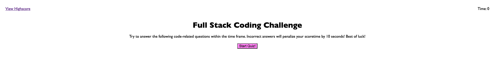

# Full Stack Quiz

## Description

This full stack quiz is for those of you who wants to challenge your knowledge in Full Stack Development especially in Javascript. This will be a fun quiz for people who are just starting to code or even senior progammers who wants to play during their spare time.

## Getting Started

Follow these instructions on how the quiz is going to be played:

1. Open the link https://levigun.github.io/full-stack-quiz/ .

2. Once the page has been opened, there will be a button to start the quiz.

3. Once the button has been pressed, the first question will be displayed and a timer of 90s will start.

4. Then answer the questions accordingly. If a question is answered wrong, an alert box will show that it is wrong and 10s will be taken of your remaining time.

5. The game is over when the timer hits 0s or all the questions have been answered.

6. Then you are able to save your score with your initials in the quiz game and you will be able to see all your previous scores, if applicable.

7. A "Go Back" button will be there as well once you have entered your intials. This button will direct you the first page.

8. You can either play the quiz again, check all the scores by clicking the "View Highscore" link at the top-left of the page, or even exit the page.

## Full Stack Quiz Look

## Credits
https://coding-boot-camp.github.io/full-stack/github/professional-readme-guide

https://stackoverflow.com

https://www.youtube.com/c/Eduonix/videos

Douglas Chan - TA

David Impey - Instructor

Scott Basquill - TA

Sam Ngu - 1-on-1 Tutor

## License

©2021 Theresa Levina Gunawan.